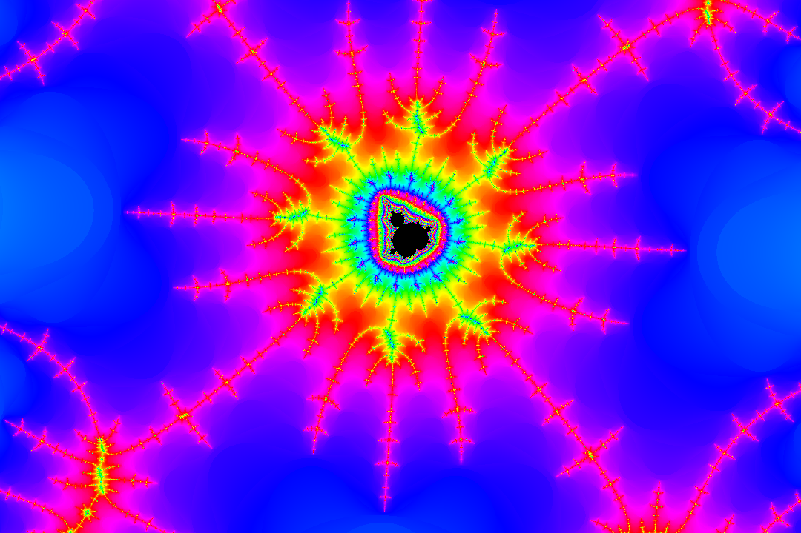

A simple app that lets you zoom into a visualization of the mandelbrot set.
The zoom depth is limited by the accuracy of floating point numbers.

### Screenshots




### Build
I am not an expert on CMake, but the following works:
Start in the project root directory
1. Clear `build/`
    ```shell
    rm -rf build
    ```
2. Run `cmake` while specifying release or debug configuration (`Release` or `Debug`)
    ```shell
    cmake -S . -B build -DCMAKE_BUILD_TYPE=Release
    ```
3. Build
    ```shell
    cmake --build build -- -j$(nproc)
    ```
4. Find the compiled binary in `bin-Release/` or `bin-Debug/`

###### Build Options
These options are defined/checked by the cmake/ helper modules in the repo.

- `-DCMAKE_BUILD_TYPE=<Debug|Release|RelWithDebInfo|MinSizeRel>`
    - For single-config generators (Make/Ninja). Controls optimization, debug info and many helper generator-expressions.
    - Example: -DCMAKE_BUILD_TYPE=Release

- `-DENABLE_CLANG_TIDY=ON|OFF (default: OFF)`
    - If ON, CMake will attempt to find clang-tidy and attach it to the target using CXX_CLANG_TIDY.
    - In the project it is configured to run for the Debug config only (via a generator expression).
    - Requires clang-tidy to be installed on your PATH.

- Sanitizer options (these are read by cmake/Sanitizers.cmake) — set them at configure time:
    - `-DENABLE_SANITIZER_ADDRESS=ON` — enable AddressSanitizer (ASan) in Debug.
    - `-DENABLE_SANITIZER_LEAK=ON` — enable Leak sanitizer.
    - `-DENABLE_SANITIZER_UNDEFINED_BEHAVIOR=ON` — enable UBSan.
    - `-DENABLE_SANITIZER_THREAD=ON` — enable ThreadSanitizer (TSan) — incompatible with Address/Leak.
    - `-DENABLE_SANITIZER_MEMORY=ON` — MemorySanitizer (Clang only), incompatible with Address/Thread/Leak.
    - `-DENABLE_COVERAGE=ON` — enable coverage flags for gcc/clang (used for Debug).

    - Notes & rules:
        - Sanitizer flags are applied only to Debug builds (the project uses generator expressions so they don’t affect Release).
        - The helper emits warnings if you request incompatible sanitizer combinations (e.g. thread + address).

- `-DCMAKE_INSTALL_PREFIX=/some/path`
    - Used by cpack / cmake --install flows. Not required for development builds.

###### How the repository wiring works (brief)
I guess only relevant if one tries to fix a bug in the cmake setup.

- `MandelbrotApp` – the executable target.
- `ImGuiLib` – a static library target that builds the ImGui core + GLFW + OpenGL backends (imgui_impl_glfw.cpp, imgui_impl_opengl3.cpp).
- `glad` – a STATIC library built from lib/GLAD/glad.c. It provides GL function pointers and must be compiled with C enabled.
- `ImGuiLib` links glad as PUBLIC, so consumers of ImGuiLib automatically get glad transitively. The final executable links to ImGuiLib (and system libs).
- `cmake/CompilerWarnings.cmake`, `cmake/Sanitizers.cmake`, `cmake/StaticAnalysis.cmake` provide helper functions and options.
